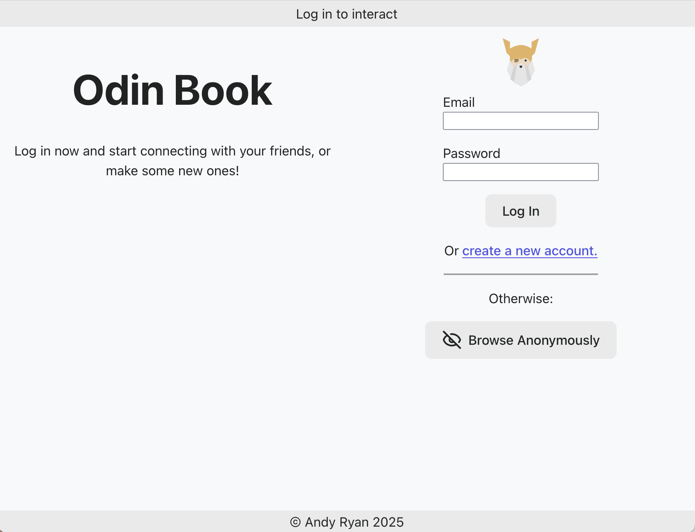

# App Name

## Table of Contents

- [Description](#description)
- [Installation Instructions](#installation-instructions)
- [Usage and Screenshots](#usage-and-screenshots)
- [Technologies Used](#technologies-used)
- [Dependencies and Credits](#dependencies-and-credits)
- [Project Structure](#project-structure)

## Description

Write a paragraph or two describing the project here.

## Installation Instructions

1. Clone or fork this repo
2. cd into the project root directory (where the README.md file is located)
3. Run the following in your terminal
    - ``` bash
      npm init -y
      npm install dependencies_separated_by_spaces
      npm install devDependencies_separated_by_spaces --save-dev
      ```
    - ``` bash   <!-- node -->
      CREATE DATABASE database_name;
      \c database_name
      \q
      npx tsc --init  
      npx prisma  
      npx prisma init  
      code .env
      ```
1. <!-- node --> In the .env file 
   - ``` bash
     NODE_ENV=development
     TEST_DATABASE_URL="your_local_test_database_url"
     DATABASE_URL="your_local_database_url"
     SECRET_KEY="your_secret_key"
     ```
1. <!-- node --> `code prisma/schema.prisma`
1. <!-- react --> If running the API locally
   1. Find the URL
       - For a Node.js / Express app this would be in: *backend_folder/app.js* at the bottom
   2. Update the API URL
        -  ``` bash
           code src/functions/apiCommunication.js 
           ```
        - Update `const apiUrl` with the new URL. It is likely http://localhost:3000
          - Be sure to remove the trailing "/" if there is one
1. `npm run dev`
   - `^` + `c` will end the process 
1. <!-- react --> Navigate to the url displayed in the terminal: `➜  Local:   http://localhost:5173/` 
1. <!-- node --> After making updates to ./src/queries.ts you'll want to run this to recompile queries.js 
   - ``` bash
     npx tsc
     ```

## Usage and Screenshots



Here's a brief description of how to use the app.

- [Link to live preview](https://groundedwanderer.dev/)
- [Link to backend repo](https://github.com/aRav3n/odin-book-backend)

### Features
- Feature one
- Feature two

## Technologies Used

<!-- Remove what is not applicable -->
### Frontend

- <a href="https://vite.dev/"> Vite </a>
- <a href="https://react.dev/"> React</a>
- <a href="https://webpack.js.org/"> Webpack</a>
- <a href="https://developer.mozilla.org/en-US/docs/Web/JavaScript"> JavaScript</a>
- <a href="https://developer.mozilla.org/en-US/docs/Web/HTML"> HTML</a>
- <a href="https://developer.mozilla.org/en-US/docs/Web/CSS"> CSS</a>

### Backend          
- <a href="https://nodejs.org"> Node.js</a>
- <a href="https://expressjs.com/"> Express</a>
- <a href="https://www.postgresql.org/"> PostgreSQL</a>
- <a href="https://www.prisma.io/"> Prisma ORM</a>
- <a href="https://www.typescriptlang.org/"> TypeScript</a>
- <a href="https://jestjs.io/"> Jest</a>

### Development Tools

- <a href="https://code.visualstudio.com/"> VS Code</a>
- <a href="https://www.npmjs.com/"> NPM</a>
- <a href="https://git-scm.com/"> Git</a>

### Hosting

- <a href="https://www.cloudflare.com/"> Cloudflare</a>
- <a href="https://github.com/"> Github</a>
- <a href="https://neon.com/"> Neon</a>
- <a href="https://render.com/"> Render</a>


## Dependencies and Credits

### Package Dependencies

- [packageName](https://www.npmjs.com/package/packageName)

### Other Credits

- [Devicion](https://devicon.dev/)
- [Skillicons](https://skillicons.dev/)


## Project Structure

```bash
├──controllers/            # Controller files
├──db/                     # Compiled queries.js
├──generated/              # Generated Prisma files
├──prisma/                 # Prisma models and migrations
├──public/                 # Locally hosted images and icons
├──routes/                 # Router files
├──src/                    # Source files
    ├── controllers/       # Request handlers
    └── server.ts
└──test/                   # Test files
```
